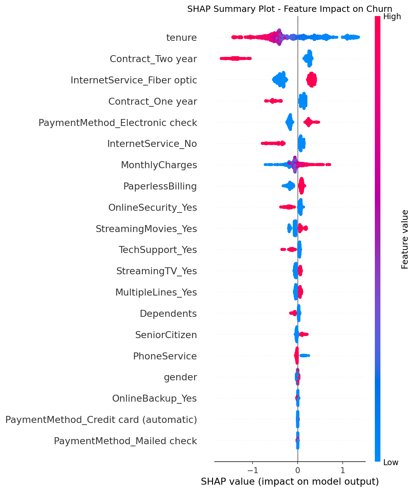
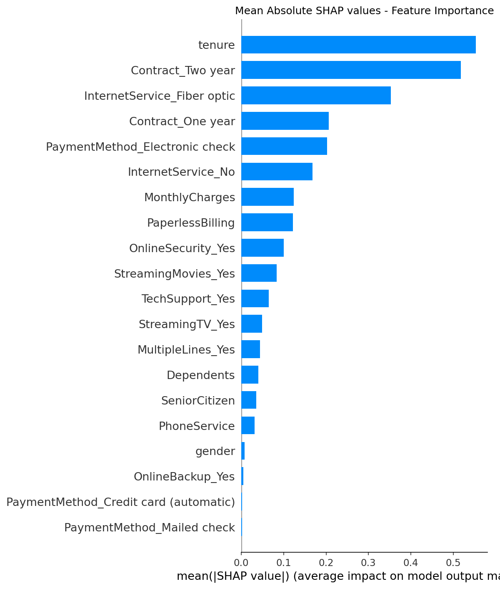

# Customer Churn Prediction — MLOps Pipeline

An end-to-end machine learning pipeline that predicts customer churn for a telecom company, with full MLOps tooling including experiment tracking, model explainability, REST API deployment, and containerization.

## Problem Statement

A telecom company loses revenue every time a customer cancels their subscription. This project builds a model that predicts which customers are likely to churn before they do — enabling targeted retention interventions.

## Results

| Model | ROC-AUC | Recall | F1 |
|---|---|---|---|
| Logistic Regression (baseline) | 0.8387 | 0.77 | 0.61 |
| Random Forest | 0.8390 | 0.73 | 0.62 |
| XGBoost (baseline) | 0.8394 | 0.79 | 0.63 |
| XGBoost (tuned) | 0.8458 | 0.82 | 0.63 |

Best model catches 82% of churners before they leave.

## Tech Stack

- **ML:** XGBoost, Scikit-learn, Random Forest, Logistic Regression
- **Explainability:** SHAP
- **Experiment Tracking:** MLflow
- **API:** FastAPI + Pydantic
- **Dashboard:** Streamlit
- **Containerization:** Docker
- **Data:** IBM Telco Customer Churn Dataset (7,043 records)

## Project Structure
churn-prediction-mlops/
01_eda.ipynb                 # Exploratory data analysis
02_feature_engineering.ipynb # Feature engineering + baseline model
03_models.ipynb              # XGBoost, Random Forest, MLflow tracking
04_shap.ipynb                # SHAP explainability analysis
app.py                       # FastAPI prediction endpoint
streamlit_app.py             # Streamlit dashboard
Dockerfile                   # Docker container configuration
requirements.txt             # Python dependencies

## Key Findings

- Contract type is the strongest churn predictor — month-to-month customers churn at 45% vs 3% for two-year contracts
- Low tenure customers (under 12 months) are highest risk
- Fiber optic internet customers churn more despite premium pricing
- Electronic check payment correlates strongly with churn

## How to Run

**1. Clone the repository**
```bash
git clone https://github.com/Vedant6671/churn-prediction-mlops.git
cd churn-prediction-mlops
```

**2. Install dependencies**
```bash
pip install -r requirements.txt
```

**3. Run FastAPI**
```bash
python app.py
```

**4. Run Streamlit dashboard**
```bash
streamlit run streamlit_app.py
```

**5. Or run with Docker**
```bash
docker build -t churn-prediction-mlops .
docker run -p 8000:8000 churn-prediction-mlops
```

## SHAP Explainability

The model is fully explainable using SHAP values. The highest risk customer in the test set had a 93.4% churn probability driven by low tenure, fiber optic internet, no long term contract, and electronic check payment.


